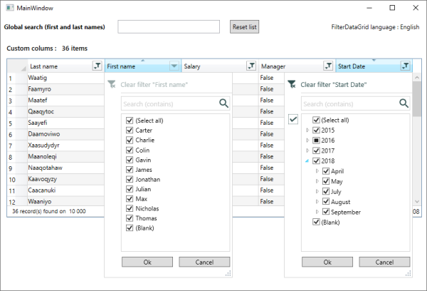

<!--
Edited
https://dillinger.io/
-->

# WPF Filterable Datagrid, multi language


## How to use
 - Include the **FilterDataGrid** folder in your project   

 - Add **FilterDataGrid.xaml** to App.xaml as MergedDictionaries   
```
    <Application.Resources>
        <ResourceDictionary>
            <ResourceDictionary.MergedDictionaries>
	    	<ResourceDictionary Source="FilterDataGrid/FilterDataGrid.xaml" />
		...
```  
   
 - Add **FilterDatagrid** into your xaml :   
 
      - **Namespace**      
		`xmlns:control="clr-namespace:FilterDataGrid"`
	  - **Control**   
		`<control:FilterDataGrid ...`   
		- Available properties
		  - (bool) **ShowStatusBar**      : *Displays the status bar*, default : false
		  - (bool) **ShowElapsedTime**    : *Displays the elapsed time of filtering in status bar*, default : false
		  - (string) **DateFormatString** : *Date display format*, default : "d"
		  - (enum) **FilterLanguage**     : *Translation into available language*, default : English   
		  *Languages available : English, French, Russian, German, Italian, Chinese*   
			> The translations are from google translate, if you find any errors please let me know.
		> *If you add custom columns, you must set **AutoGenerateColumns"False"***  
		
	  - **Custom TextColumn**   
		```
		<control:FilterDataGrid.Columns>   
		    <control:DataGridTextColumn IsColumnFiltered="True" ...
		```
	  - **Custom TemplateColumn**  
	    > ***FieldName** property of **DataGridTemplateColumn** is required*   
	    
		```
		<control:FilterDataGrid.Columns>   
		    <control:DataGridTemplateColumn IsColumnFiltered="True" FieldName="LastName" ...
		```
		
		   

