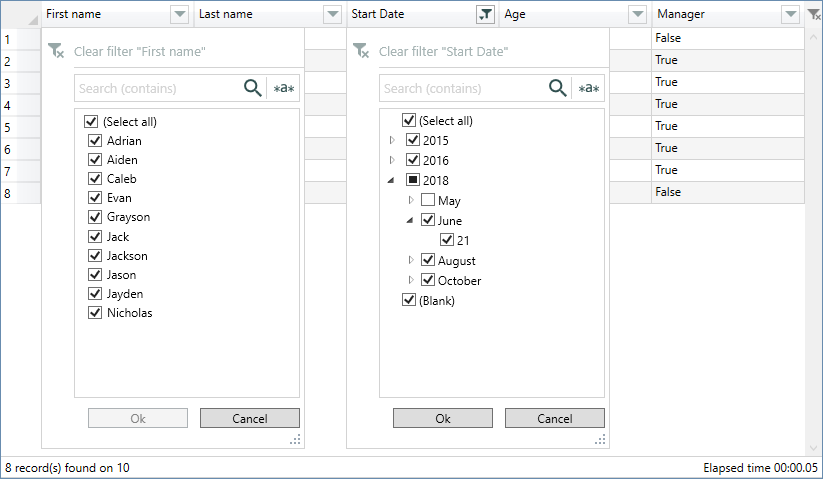
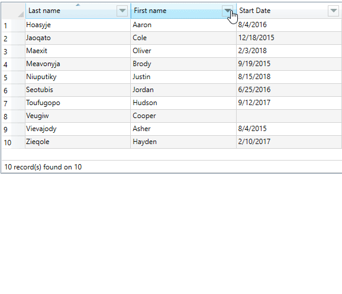

<!--
Edited
https://dillinger.io/
https://kramdown.gettalong.org/quickref.html
https://shields.io/category/version
-->
# WPF Filterable DataGrid, multi language

<!--

-->

## This branch is an experimental version of FilterDataGrid

> Do not use it outside of any experimental or testing context.  
The new filtering method is completely different from the current version or the one commonly used to filter data (as far as I know).  
Its operation is the closest to that of Excel.  
In its final version there will be the choice between two filtering modes : 
Excel or the current method.  


  

## How to use

- Add **Namespace** into your xaml :  

```xml
    <Window xmlns:control="http://filterdatagrid.control.com/2021" ..
```

- **Control**  

```xml
  <control:FilterDataGrid 
   FilterLanguage="English" DateFormatString="d" ShowStatusBar="True" ShowElapsedTime="False"
   ExcludeFields="lastname,age,manager" ...
```

- Properties
  - **ShowStatusBar** : *displays the status bar*, default : false  
  - **ShowElapsedTime** : *displays the elapsed time of filtering in status bar*, default : false  
  - **ShowRowsCount** : *display the number of rows*, default : false  
  - **FilterLanguage** : *translation into available language*, default : English  
  - **ExcludeFields** : *comma separated fields to exclude from filter, only works in AutoGenerateColumns mode*  
  - **DateFormatString** : *date display format*, default : "d"  

  > :warning: **Before version 1.2.5.2**, you must set the "Time" part of the DateTime fields to zero, otherwise the filter doesn't work.  
[see the documentation "Standard date and time format strings"](https://docs.microsoft.com/en-us/dotnet/standard/base-types/standard-date-and-time-format-strings)

- **Custom TextColumn**
     > *If you add custom columns, you must set **AutoGenerateColumns="False"***

  ```xml
  <control:FilterDataGrid.Columns>   
      <control:DataGridTextColumn IsColumnFiltered="True" ...
  ```

- **Custom TemplateColumn**  
     > :warning: ***FieldName** property of **DataGridTemplateColumn** is required*

  ```xml
  <control:FilterDataGrid.Columns>   
      <control:DataGridTemplateColumn IsColumnFiltered="True"
                               FieldName="LastName" ...
  ```

## Global Style

>You can define a global style which overrides the default style of "FilterDataGrid"  

```xml
<Style
            x:Key="FilterDatagridStyle"
            BasedOn="{StaticResource {ComponentResourceKey TypeInTargetAssembly=control:FilterDataGrid,
                                                           ResourceId=FilterDataGridStyle}}"
            TargetType="{x:Type control:FilterDataGrid}">
            <Setter Property="Margin" Value="10" />
            <Setter Property="RowHeaderWidth" Value="40" />
     ...
</Style>
```

## Benchmark

> Intel Core i7, 2.93 GHz, 16 GB, Windows 10, 64 bits.  
> Tested on the "Last name" column of the demo application using a random distinct name generator, between 5 and 8 letters in length.  
> *The elapsed time decreases based on the number of columns and filtered items.*

Number of rows | Opening of the PopUp | Applying the filter | Total (PopUp + Filter)
 --- | --- | --- | ---
10 000 | < 1 second | < 1 second | < 1 second
100 000 | < 1 second | < 1 second | < 1 second
500 000 | ± 2.5 second | < 1 second | ± 2.6 second
1 000 000 | ± 4.5 second | < 1 second | ± 4.8 second

## Demonstration

  

## Contributors

<a href="https://github.com/Apflkuacha" target="_blank">
  
</a>
<a href="https://github.com/wordiboi" target="_blank">
  
</a>
<a href="https://github.com/ottosson" target="_blank">
  
</a>

<!-- Made with [contributors-img](https://contrib.rocks). -->
<a href="https://github.com/macgile/DataGridFilter/graphs/contributors">
  
</a>
